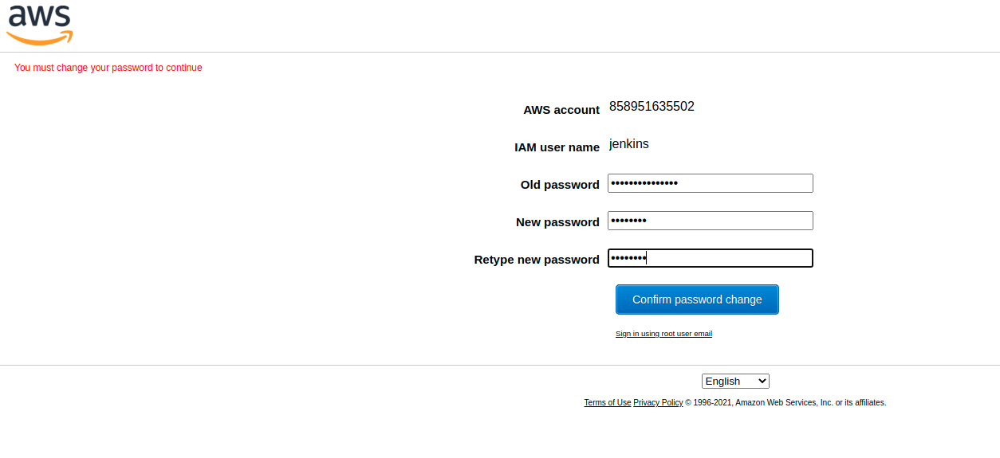
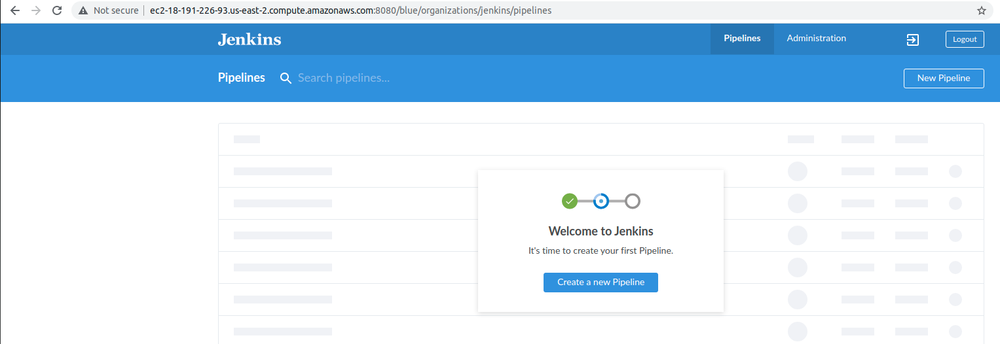
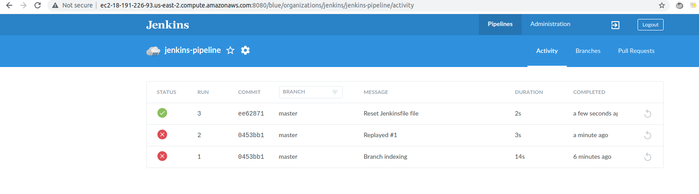
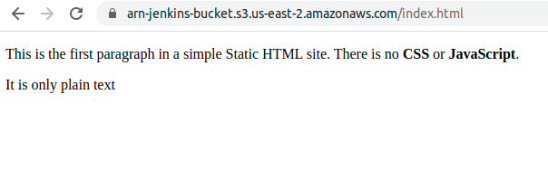
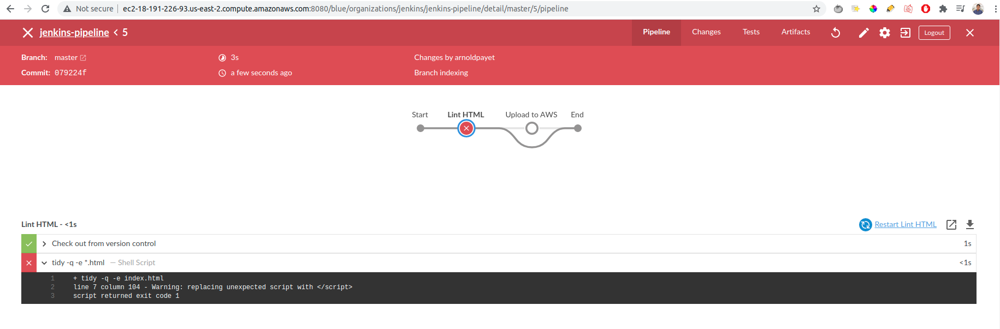
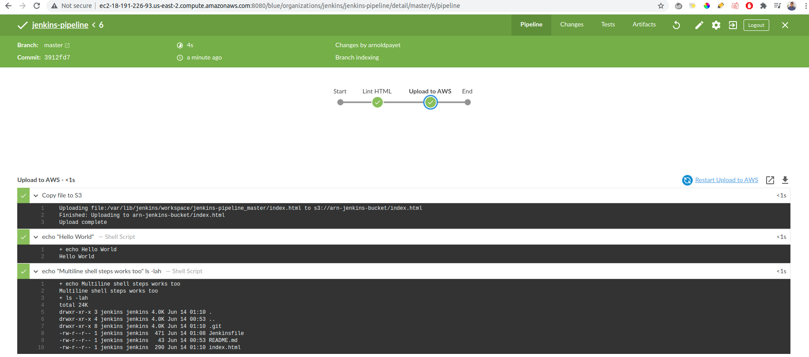

# Jenkins Pipeline on AWS
In this project we will deploy and run an instance on AWS, configure Jenkins, and create a pipeline to deploy a static website on S3.

## Outline of this Project
Here is a outline of the steps taken:

- AWS Steps
- Install Jenkins On Ubuntu
- Set up Jenkins
- Install required plugins
- Set up GitHub
- Set up AWS credentials in Jenkins
- Set up S3 Bucket
- Set up pipeline for AWS
- Addd another stage in pipeline

## Links
[Jenkins instance](http://ec2-18-223-122-156.us-east-2.compute.amazonaws.com:8080/)

[Static site bucket](https://arn-jenkins-bucket.s3.us-east-2.amazonaws.com/index.html)

## Screenshots

### Screenshot 01
jenkins user authentication:

### Screenshot 02
Jenkins installation on EC2 instance:

### Screenshot 03
Blue Ocen plugin running:

### Screenshot 04
Github pipelines:

### Screenshot 05
Static site's file on S3:

### Screenshot 06
Lint HTML stage fail:

### Screenshot 07
Lint HTML stage success:

